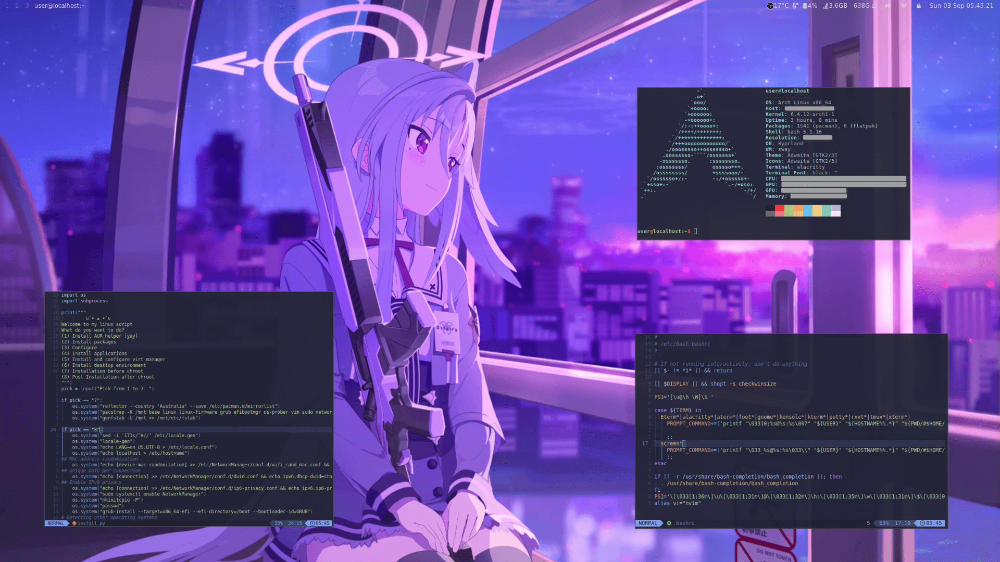

<h3 align="center">archdotfile</h3>



## About
Config for my arch desktop with install script

## System Requirements

* Arch or Arch based distro
* sudo and python3 installed
* Logged into user with sudo privileges (not root)

## Usage
Use this script
```
python3 install.py
```
## Start window manager
```
Hyprland
```
